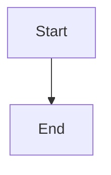

# mdv - Markdown Viewer

A fast, cross-platform markdown file viewer with native HTML rendering.

## Features

- **Native HTML rendering** - Converts markdown to HTML and renders with native controls
- **Cross-platform** - Runs on Windows, macOS, and Linux
- **Lightweight** - Single executable, no installation required
- **Fast startup** - Optimized for performance
- **GitHub-style rendering** - Professional appearance with proper typography
- **ESC to quit** - Simple keyboard shortcut
- **Mermaid diagram detection** - Identifies and labels mermaid diagrams

## Installation

### Download Prebuilt Binaries

| Platform | File | Size |
|----------|------|------|
| Windows x64 | `mdv-win-x64.exe` | ~17MB |
| macOS x64 (Intel) | `mdv-osx-x64` | ~17MB |
| macOS ARM64 (Apple Silicon) | `mdv-osx-arm64` | ~17MB |
| Linux x64 | `mdv-linux-x64` | ~18MB |

### Build from Source

```bash
git clone https://github.com/yourusername/mdv.git
cd mdv
dotnet publish MarkdownViewer -c Release -r <runtime> --self-contained -p:PublishSingleFile=true
```

## Usage

```bash
# Basic usage
mdv README.md
mdv docs/api.md

# File extension is optional
mdv README
mdv documentation

# Show usage info
mdv
```

## Supported Markdown Elements

- Headers (H1, H2, H3) with proper hierarchy
- **Bold** and *italic* text
- `Inline code` and code blocks
- [Links](https://example.com)
- Lists (ordered and unordered)
- > Blockquotes with left border
- Tables
- Horizontal rules
- Line breaks and paragraphs

## Mermaid Diagrams

The viewer detects Mermaid diagram code blocks and displays them with a special indicator:

```markdown

```

## Keyboard Shortcuts

- **ESC** - Quit the application
- **Mouse wheel** - Scroll content
- **Scroll bar** - Navigate long documents

## Technical Details

- Built with [Avalonia UI](https://avaloniaui.net/) for cross-platform compatibility
- Uses [Markdig](https://github.com/xoofx/markdig) for markdown parsing
- Native control rendering for optimal performance
- Self-contained executables with minimal dependencies

## Contributing

1. Fork the repository
2. Create a feature branch
3. Make your changes
4. Submit a pull request

## License

MIT License - see LICENSE file for details.

---

*Made with ❤️ using Avalonia and .NET*