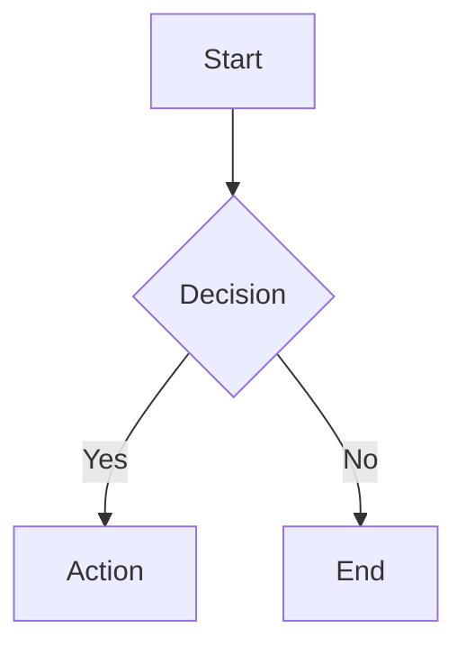

# mdv - Markdown Viewer

A fast, cross-platform markdown file viewer with native HTML rendering.

## Features

- **Full HTML rendering** - Opens markdown in your default browser with complete HTML support
- **Mermaid diagram support** - Renders actual interactive Mermaid diagrams
- **Cross-platform** - Runs on Windows, macOS, and Linux
- **Lightweight** - Single executable, no installation required
- **Fast startup** - Optimized for performance
- **GitHub-style styling** - Professional appearance with dark mode support
- **Smart file detection** - Automatically adds .md extension if needed
- **Auto-cleanup** - Temporary files are cleaned up automatically

## Installation

### Download Prebuilt Binaries

| Platform | File | Size |
|----------|------|------|
| Windows x64 | `mdv-win-x64.exe` | ~17MB |
| macOS x64 (Intel) | `mdv-osx-x64` | ~17MB |
| macOS ARM64 (Apple Silicon) | `mdv-osx-arm64` | ~17MB |
| Linux x64 | `mdv-linux-x64` | ~18MB |

### Build from Source

```bash
git clone https://github.com/yourusername/mdv.git
cd mdv
dotnet publish MarkdownViewer -c Release -r <runtime> --self-contained -p:PublishSingleFile=true
```

## Usage

```bash
# Basic usage
mdv README.md
mdv docs/api.md

# File extension is optional
mdv README
mdv documentation

# Show usage info
mdv
```

## Supported Markdown Elements

- Headers (H1, H2, H3) with proper hierarchy
- **Bold** and *italic* text
- `Inline code` and code blocks
- [Links](https://example.com)
- Lists (ordered and unordered)
- > Blockquotes with left border
- Tables
- Horizontal rules
- Line breaks and paragraphs

## Mermaid Diagrams

The viewer fully supports Mermaid diagrams with interactive rendering:

```markdown

```

Diagrams are rendered as interactive SVG with zoom and pan capabilities.

## How it Works

1. `mdv` converts your markdown to HTML using Markdig
2. Creates a temporary HTML file with GitHub-style CSS and Mermaid support
3. Opens the file in your default browser
4. Auto-closes the launcher after 3 seconds
5. Cleans up temporary files when you close the browser

## Browser Features

- **Dark mode support** - Automatically adapts to system preferences
- **Print-friendly** - Optimized CSS for printing
- **Responsive design** - Works on any screen size
- **ESC to close** - Browser keyboard shortcut support

## Technical Details

- Built with [Avalonia UI](https://avaloniaui.net/) for cross-platform launcher
- Uses [Markdig](https://github.com/xoofx/markdig) for markdown parsing
- Leverages native browser engines for HTML rendering
- [Mermaid.js](https://mermaid.js.org/) for diagram rendering
- Self-contained executables with minimal dependencies

## Contributing

1. Fork the repository
2. Create a feature branch
3. Make your changes
4. Submit a pull request

## License

MIT License - see LICENSE file for details.

---

*Made with ❤️ using Avalonia and .NET*