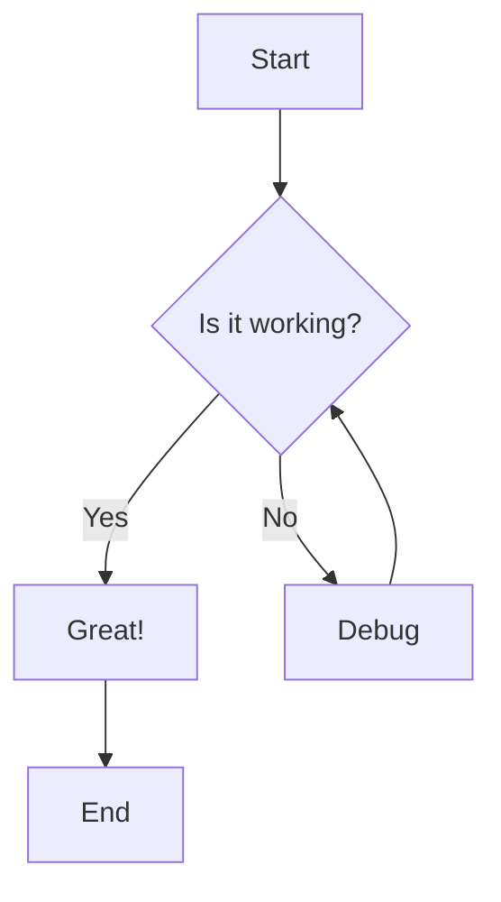

# Sample Markdown File

This is a test markdown file to demonstrate the markdown viewer.

## Features

- **Bold text**
- *Italic text*
- `Code inline`
- [Links](https://example.com)

## Code Block

```csharp
public class HelloWorld
{
    public static void Main()
    {
        Console.WriteLine("Hello, World!");
    }
}
```

## Lists

1. First item
2. Second item
3. Third item

- Bullet one
- Bullet two
- Bullet three

## Tables

| Column 1 | Column 2 | Column 3 |
|----------|----------|----------|
| Data 1   | Data 2   | Data 3   |
| Data 4   | Data 5   | Data 6   |

## Quotes

> This is a blockquote example.
> It can span multiple lines.

Press **ESC** to quit the viewer.

## Mermaid Diagram Example



## Flowchart Example

