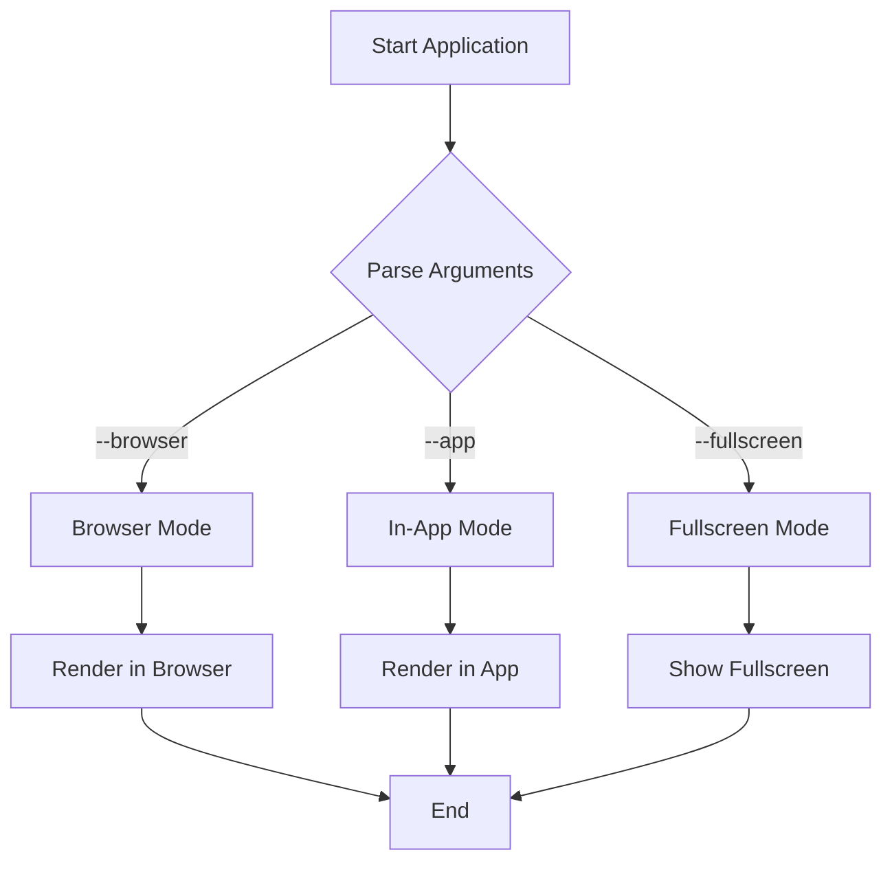

# Visual Test Document

This document is designed for **visual verification** of the markdown viewer's rendering capabilities.

## Text Formatting

- **Bold text** should be clearly distinguishable
- *Italic text* should be slanted
- `Inline code` should have a different background
- ~~Strikethrough text~~ should have a line through it

### Mixed Formatting

You can combine **bold and *italic*** formatting, as well as **bold with `code`** elements.

## Code Blocks

### JavaScript Example

```javascript
function greetUser(name) {
    console.log(`Hello, ${name}!`);
    return true;
}

// Call the function
greetUser("World");
```

### C# Example

```csharp
public class MarkdownViewer 
{
    public string Title { get; set; } = "mdv";
    
    public void RenderMarkdown(string content)
    {
        // Render logic here
    }
}
```

## Mermaid Diagram

The following should show a blue box with a "View in Browser" button:



## Tables

| Feature | In-App | Browser | Status |
|---------|--------|---------|--------|
| Text Rendering | ✅ | ✅ | Complete |
| Code Highlighting | ❌ | ✅ | Browser Only |
| Mermaid Diagrams | ⚠️ | ✅ | Click to View |
| Copy Functions | ✅ | ❌ | In-App Only |
| Fullscreen Mode | ✅ | ❌ | In-App Only |

## Blockquotes

> This is a blockquote that should have a left border and different styling.
> 
> It can span multiple lines and should maintain consistent formatting throughout.

### Nested Lists

1. First numbered item
   - Nested bullet point
   - Another nested item
     - Deeply nested item
2. Second numbered item
   1. Nested numbered item
   2. Another nested numbered item
3. Third numbered item

## Horizontal Rule

---

## Links and Images

[GitHub Repository](https://github.com/DanMarshall909/mdv) - This should be blue and underlined.

## Keyboard Shortcuts to Test

- **F11**: Toggle fullscreen mode
- **ESC**: Exit fullscreen or close application
- **Ctrl+B**: Toggle between app and browser modes
- **Ctrl+C**: Copy content as plain text
- **Ctrl+Shift+C**: Copy content as rich text
- **Ctrl+Alt+C**: Copy content as HTML
- **Ctrl+M**: Copy original markdown

## Visual Verification Checklist

When testing this document, verify:

- [ ] All headings have proper hierarchy and styling
- [ ] Text formatting (bold, italic, code) renders correctly
- [ ] Code blocks have proper background and font
- [ ] Mermaid diagram shows blue detection box
- [ ] Table has borders and proper header styling
- [ ] Blockquote has left border and italic text
- [ ] Lists are properly indented and formatted
- [ ] Links are blue and underlined
- [ ] Horizontal rule is visible
- [ ] All keyboard shortcuts work as expected
- [ ] Fullscreen mode works properly
- [ ] Copy functions work correctly

## Test Instructions

1. Open this file with: `mdv visual_test.md`
2. Test in-app mode (default)
3. Press **Ctrl+B** to switch to browser mode
4. Press **F11** to test fullscreen mode
5. Test all copy shortcuts
6. Compare rendering between modes
7. Verify all visual elements match expectations

---

*End of visual test document - all features above should render correctly*